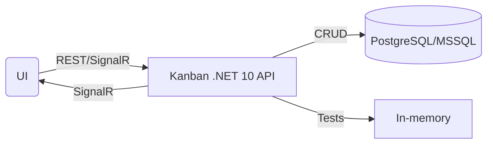

# KanbanRestfulSolution

> A modern, production-grade RESTful Kanban API using ASP.NET Core, Docker, PostgreSQL/MSSQL, SignalR, and JWT authentication.

[](https://github.com/Dijenek91/KanbanRestfulSolution/actions)
[](https://codecov.io/gh/Dijenek91/KanbanRestfulSolution)

## Overview

**KanbanRestfulSolution** is a robust, enterprise-ready REST API for managing Kanban board tasks, built on the .NET 10 framework. Originally conceptualized as a Java interview challenge found on reddit, this project highlights modern software engineering best practices, scalable architecture, and extensive test coverage.

Key features include:
- Full RESTful CRUD for Kanban tasks (with robust validation, pagination, filtering, and sorting)
- Database abstraction with support for PostgreSQL (default, via Docker), MSSQL (development), and SQLite (integration testing)
- Real-time updates via SignalR: clients receive push notifications for task creation, edits, and deletions
- Clean architecture with AutoMapper for DTO/entity separation, and OpenAPI 3/Swagger documentation
- JWT-based authentication and authorization (secure endpoints)
- HATEOAS (hypermedia links) for API resource navigation
- GraphQl support for flexible querying (bonus)
- High code quality enforced through CI, code coverage, and 80%+ automated tests

---

## Features

- **RESTful API Endpoints**  
  Supports all Kanban task operations:
  - `GET /api/tasks` (list, with filters/pagination)
  - `GET /api/tasks/{id}` (retrieve by ID)
  - `POST /api/tasks` (create)
  - `PUT /api/tasks/{id}` (full update)
  - `PATCH /api/tasks/{id}` (partial update via DTO or JSON Patch)
  - `DELETE /api/tasks/{id}` (remove)
  - HATEOAS links in resource representation
  - GraphQL endpoint for flexible querying

- **Data Persistence**  
  - **Production**: PostgreSQL container via Docker Compose
  - **Dev**: Microsoft SQL Server support
  - **Tests**: In-memory SQLite

- **Authentication & Security**  
  - JWT Bearer token authentication (`/api/Auth/login`)
  - Secure endpoints – all mutation routes require a valid token
  - Password verification implemented as a demo (not for production)

- **Real-Time Messaging**  
  - SignalR hub for live event push to UI clients

- **Validation & Documentation**
  - Request validation throughout (models, DTOs)
  - Interactive Swagger/OpenAPI (with limitations for JWT auth testing)
  - Automated tests: 80%+ coverage

---

## Getting Started

### Requirements

- [.NET 10 SDK](https://dotnet.microsoft.com/)
- [Docker & Docker Compose](https://www.docker.com/)
- (Optional) SQL Server (Dev)

### Quick Start (Docker: API + PostgreSQL)

```sh
# Clone the repo
git clone https://github.com/Dijenek91/KanbanRestfulSolution.git
cd KanbanRestfulSolution

# Build containers
docker compose build

# Run services (API on :8080, PostgreSQL included)
docker compose up
```

#### Set Environment Variables (for JWT)

```sh
docker run --rm -p 8080:8080 \
  -e SuperSecretJwtKey=supersecretkey12345678901234567890 \
  -e Issuer=MyKanbanTaskApp \
  -e Audience=MyKanbanTaskApp \
  kanbanrestservice:dev
```

The API will be available at `http://localhost:8080`.

### Running Tests

- All pull requests/commits trigger the CI workflow: build, run all unit/integration tests, and publish code coverage reports.
- Test results are viewable in GitHub Actions.
- For local test run: `dotnet test`

### Postman Collection

- Use the official Postman collection ([link](https://web.postman.co/workspace/My-Workspace~3be1e0e9-c3e8-4732-800c-bb6ad975a485/collection/6602988-e533ff4c-6fa5-47d1-a054-6f2004b6fc6d))
- Set the environment: [link](https://web.postman.co/workspace/My-Workspace~3be1e0e9-c3e8-4732-800c-bb6ad975a485/environment/6602988-ca9ebc0d-1512-40a8-8145-8495ebf0b111)
- Manual JWT auth: after login (`POST /api/Auth/login`), set `jwt_token` variable in the Postman environment

---

## Architecture Diagram



---

## Technologies

- .NET 10 (ASP.NET Core)
- Entity Framework Core
- AutoMapper
- SignalR
- PostgreSQL, MSSQL, SQLite
- Docker & Docker Compose
- JWT authentication
- Swagger/OpenAPI 3
- xUnit, Moq, CodeCov

---

## Performance

- Expected: `GET /api/tasks?page=0&size=50` responds in under 150 ms (local laptop; depends on environment)

---

## CI/CD

- Automated CI on push/PR: checks out, builds, tests, uploads artifacts
- Code coverage tracked via Codecov

---

## Author

**Dijenek91**

- [GitHub Profile](https://github.com/Dijenek91)
- [My comics page] (https://www.instagram.com/gogi_strip/)
---
